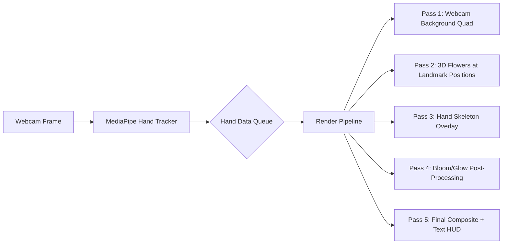

# Interactive Blooming Flower — Complete Rewrite Plan

## Reference Screenshot


## Analysis of Current Code vs. Target

### What the original TouchDesigner project does (from the screenshot):
1. **Webcam feed as background** — The person is visible behind the flowers
2. **Multiple flowers** — ~6-8 flowers growing from **both hands**, each on its own thin green stem
3. **Flowers positioned at fingertip landmarks** — Each flower sprouts from a specific finger joint position
4. **Realistic fire-orange/golden petals** — Not flat pink/yellow, but a warm fire gradient (deep orange → bright golden yellow at tips)
5. **Bird-of-Paradise / Strelitzia-like petal shape** — Long, curved, spiky petals that fan upward, NOT a rose-like round arrangement
6. **Bright emissive glow/bloom post-processing** — Flowers have a warm luminous glow that bleeds into surrounding pixels
7. **Hand skeleton wireframe overlay** — Blue/purple lines connecting hand landmarks visible on the webcam feed
8. **"Bloom: 0.23" text overlay** — Debug/status text showing the pinch distance value
9. **Both hands tracked** — `num_hands=2`, not 1
10. **Stems are thin, slightly curved, growing upward** from each fingertip position

### What the current Python code does (problems):
| Issue | Current State | Required State |
|-------|--------------|----------------|
| Background | Solid dark color `(0.05, 0.05, 0.1)` | Live webcam feed |
| Flower count | Single flower at center | Multiple flowers at each fingertip |
| Petal shape | Flat 2D triangles (6 verts) | Curved, elongated, 3D petal geometry |
| Petal color | Pink-to-yellow gradient | Fire-orange to golden-yellow |
| Glow/Bloom | None | Heavy bloom post-processing effect |
| Stem | Flat 2D rectangle | Thin 3D cylinder, one per flower |
| Hand count | 1 hand only | 2 hands |
| Hand overlay | None | Hand skeleton wireframe drawn |
| Bloom control | Wrist X/Y rotation | Pinch distance → bloom amount |
| Rendering | Single draw, no instancing | Instanced rendering for multiple flowers |

---

## Proposed Architecture: Full Rewrite

> [!IMPORTANT]
> I recommend a **complete rewrite** of `main.py`. The current approach of using `moderngl_window` with hardcoded flat triangles is fundamentally insufficient. The new approach uses a **multi-pass rendering pipeline** with webcam compositing.

### High-Level Data Flow



---

## Proposed Changes

### Hand Tracking Pipeline

#### [MODIFY] [hand_tracking.py](file:///c:/Flowers-For-Her/hand_tracking.py)

Major upgrades:
- **Track 2 hands** (`num_hands=2`)
- **Return per-finger bloom positions**: For each hand, return a list of fingertip landmark positions (landmarks 4, 8, 12, 16, 20 = thumb, index, middle, ring, pinky tips)
- **Return per-hand pinch distance** as the bloom value
- **Return all 21 landmarks per hand** for drawing the hand skeleton wireframe
- **Return the raw webcam frame** through the queue so the render thread can display it as background

New data structure returned:
```python
{
    'frame': np.array,              # BGR webcam frame for background
    'hands': [
        {
            'bloom_value': float,   # 0.0-1.0 pinch distance
            'fingertips': [(x,y), (x,y), ...],  # 5 fingertip positions in pixel coords
            'landmarks': [(x,y), ...],          # All 21 landmarks for skeleton
            'connections': [...],               # Pairs for skeleton lines
        },
        ...  # second hand
    ]
}
```

---

### Rendering Engine (Complete Rewrite)

#### [MODIFY] [main.py](file:///c:/Flowers-For-Her/main.py)

This is the core rewrite. The new architecture consists of:

##### 1. Webcam Background Rendering
- Upload each webcam frame as an OpenGL texture
- Render a full-screen quad with this texture as the first layer
- This makes the person visible behind the flowers

##### 2. Procedural Petal Geometry
Replace the flat 2D triangles with a realistic **Bird-of-Paradise / Strelitzia** petal shape:
- Generate a curved, elongated petal mesh using parametric equations
- Each petal is ~15-20 triangles for smooth curvature
- Petal profile: narrow at base, widens in middle, pointed at tip
- Apply curvature along the length (z-displacement based on y²)
- Generate proper normals for lighting

##### 3. Flower Instancing System
For each detected fingertip position:
- Convert the MediaPipe normalized coordinates to screen/world space
- Grow a thin cylindrical **stem** from that position upward
- Place a flower head at the top of the stem
- Each flower has **5-8 petals** arranged radially with slight offsets
- The **bloom value** (pinch distance) controls how far each petal opens

##### 4. Bloom Animation in Vertex Shader
```glsl
// Petal blooming: controlled by u_bloom uniform
float openAngle = u_bloom * 1.2;  // Max spread angle
float curlBack = u_bloom * 0.4;   // Tips curl backward when fully open

// Rotate petal outward from center
mat3 bloomRotation = rotateX(-openAngle);
pos = bloomRotation * pos;

// Add organic curl at tips
pos.z += pow(pos.y, 2.5) * curlBack;
```

##### 5. Fire-Orange Color Palette (Fragment Shader)
```glsl
// Deep orange base → bright golden-yellow at tips
vec3 baseColor = vec3(0.95, 0.35, 0.05);   // Deep fire orange
vec3 tipColor  = vec3(1.0, 0.85, 0.15);    // Golden yellow
vec3 petalColor = mix(baseColor, tipColor, v_dist);

// Emissive boost for glow
float emissive = 0.4 + 0.3 * u_bloom;
petalColor *= (1.0 + emissive);
```

##### 6. Bloom/Glow Post-Processing (Multi-pass)
This is critical to match the reference screenshot's glowing look:
1. **Render flowers to an FBO** (Framebuffer Object)
2. **Brightness extraction pass**: Extract pixels brighter than a threshold
3. **Gaussian blur pass** (horizontal + vertical): Blur the bright pixels
4. **Additive blend**: Composite the blurred glow back onto the scene

##### 7. Hand Skeleton Overlay
- Draw lines between hand landmarks using a simple line shader
- Color: blue/purple as in the reference
- Draw circles at landmark positions

##### 8. HUD Text Overlay
- Render "Bloom: 0.XX" text showing the current pinch value
- Use bitmap font rendering or a simple texture atlas

---

### New File Structure

```
c:\Flowers-For-Her\
├── main.py                 # Complete rewrite — multi-pass rendering engine
├── hand_tracking.py        # Upgraded — 2-hand tracking, full landmark data
├── hand_landmarker.task    # MediaPipe model (existing)
├── shaders/                # [NEW] External shader files for cleanliness
│   ├── flower.vert         # Petal vertex shader with bloom deformation
│   ├── flower.frag         # Fire-orange petal fragment shader
│   ├── quad.vert           # Full-screen quad vertex shader
│   ├── quad.frag           # Webcam background fragment shader  
│   ├── bloom_extract.frag  # Brightness threshold extraction
│   ├── blur.frag           # Gaussian blur (used twice: H and V)
│   ├── composite.frag      # Final additive blend composite
│   ├── line.vert           # Hand skeleton line shader
│   └── line.frag           # Hand skeleton line shader
├── geometry.py             # [NEW] Procedural petal, stem, and sphere generation
├── bloom_pass.py           # [NEW] Post-processing bloom/glow pipeline
└── GEMINI.md               # Updated project documentation
```

> [!NOTE]
> I'm keeping external shader files for readability, but they can also be inlined as strings in `main.py` if you prefer a single-file approach. Let me know your preference.

---

## Open Questions

> [!IMPORTANT]
> **Single-file vs. multi-file?** The plan above proposes multiple files for clean architecture. If you'd prefer everything in 1-2 files for simplicity, I can restructure. What's your preference?

> [!IMPORTANT]  
> **Flower placement strategy**: In the reference, flowers appear at fingertip positions. Should flowers:
> - **(A)** Appear at ALL 5 fingertip positions per hand (10 flowers total with both hands)?
> - **(B)** Appear only at certain fingers (e.g., thumb, index, middle)?
> - **(C)** Appear at a fixed position and only bloom amount is controlled?
> 
> From the screenshot it looks like **(A)** — flowers at each fingertip. I'll default to this unless you say otherwise.

> [!IMPORTANT]
> **Stem direction**: In the screenshot, stems appear to grow **upward** from each fingertip. Should the stems:
> - **(A)** Always grow straight up regardless of hand orientation?
> - **(B)** Grow in the direction the finger is pointing?
> 
> I'll default to **(A)** as it matches the reference.

---

## Verification Plan

### Automated Tests
- Run `python main.py` and visually confirm:
  1. Webcam feed appears as the background
  2. Hand skeleton overlay draws correctly on both hands
  3. Flowers appear at fingertip positions
  4. Pinch gesture (thumb-to-index) smoothly controls bloom amount
  5. Fire-orange color palette matches reference
  6. Glow/bloom post-processing creates the warm luminous effect
  7. FPS stays above 30 (target: 60+)

### Manual Verification
- Side-by-side comparison with the reference screenshot
- Test with both hands visible
- Test edge cases: no hands, one hand, hands far from camera
- Verify bloom value display matches pinch distance

---

## Implementation Order

| Phase | Description | Estimated Effort |
|-------|-------------|-----------------|
| 1 | Upgrade `hand_tracking.py` for 2 hands + full landmark data | Small |
| 2 | Procedural petal geometry generation (`geometry.py`) | Medium |
| 3 | Core multi-pass render pipeline in `main.py` | Large |
| 4 | Webcam background texture compositing | Medium |
| 5 | Flower instancing at fingertip positions | Medium |
| 6 | Fire-orange shader + lighting | Small |
| 7 | Bloom/glow post-processing pipeline | Medium |
| 8 | Hand skeleton overlay + HUD text | Small |
| 9 | Polish, smoothing, and performance tuning | Medium |
